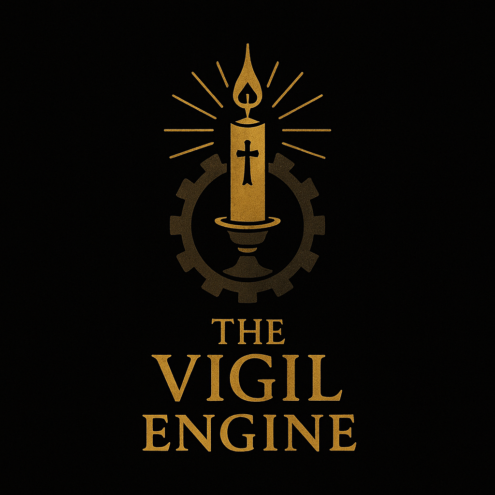

# 🔧 The Vigil Engine



<p align="center">
  
  
  <a href="#-dedication">
    
  </a>
</p>

**The Vigil Engine** is a lightweight Lua/LÖVE-based roguelike engine designed for building atmospheric, choice-rich horror games with ease. 

Features:
* Coordinate-based map loading
* Dialog and floating-text event triggers
* Inventory with dynamic item keybinding and usage
* Extendable status, music, animation, and exit logic

---

## 🚀 Quickstart

### 1. Install LÖVE

Download and install [LÖVE](https://love2d.org) for your OS.

### 2. Clone the repository

```bash
git clone https://github.com/yourusername/vigil-engine.git
```

### 3. Run the engine

```bash
love vigil-engine
```

---

## 📁 Project Structure

```
vigil-engine/
├── assets/         # Game assets (sound, fonts, music)
├── data/           # Game data (items, world, etc.)
├── engine/         # Core engine modules (map loader, status)
├── img/            # Images, including logo.png
├── maps/           # ASCII map files
├── conf.lua        # LÖVE window config
├── main.lua        # Engine entry point and game loop
├── settings.lua    # Runtime tuning (floating-text colors, speeds)
└── README.md       # This file
```

---

## 🛠️ How to Use

### Maps & Exits

* Create `.txt` maps in `maps/` using ASCII characters.
* Define exits in `data/world.lua` with coordinates and spawn points.

### Events

* In `data/world.lua`, add `events = { … }` with:

  * `type = "dialog"` → pops up text dialog.
  * `type = "floating_text"` → shows floating message (configurable color).
  * `once = true/false` → whether it repeats.

### Items & Inventory

* Define items in `data/items.lua` without fixed keys; the engine assigns keys dynamically based on order acquired.
* Add `modifiers` per item to update status.

### Settings

* Tweak floating text behavior in `settings.lua` (color, speed, fade, font).

---

## 🥉 Extending the Engine

* Add new event types (`music`, `animation`, `status`) by expanding `movePlayer()` and adding handlers.
* Integrate NPCs and scripted movement via `worldState[…].npcs`.
* Layer in audio or tile-based visuals under `assets/`.

---

## 🔧 Configuration

**Window and engine settings**

* `conf.lua` — LÖVE window configuration (size, title, console).
* `settings.lua` — runtime parameters like floating-text behavior.

---

## 🎨 Assets & Media

Place your media files here:

* `assets/` → sounds, music, fonts
* `img/logo.png` → engine/logo branding
* `maps/` → level layouts

---

## 📋 Contributing

* Create issues for bugs or feature ideas
* Submit pull requests for new modules or event types
* Help update the documentation as the engine evolves

---

## 📄 License

Include your preferred license here (e.g., MIT License).

---

## ✨ Credits

* **Engine by**: *Trevor Tomesh*
* **Logo**: Designed for *The Vigil Engine*
* **Built with**: [LÖVE](https://love2d.org), Lua

---
---

## 🕊️ Dedication

This project is dedicated to the Lord.

All logic, structure, and order — including the very foundations of programming — reflect the perfection of His design. May this tool, in its small way, point toward the beauty and coherence He has written into the fabric of creation.

> **"I praise you, for I am fearfully and wonderfully made.  
> Wonderful are your works; my soul knows it very well."**  
> — Psalm 139:14

**Soli Deo Gloria.**
---
> “And through the shadows, light endures.”
